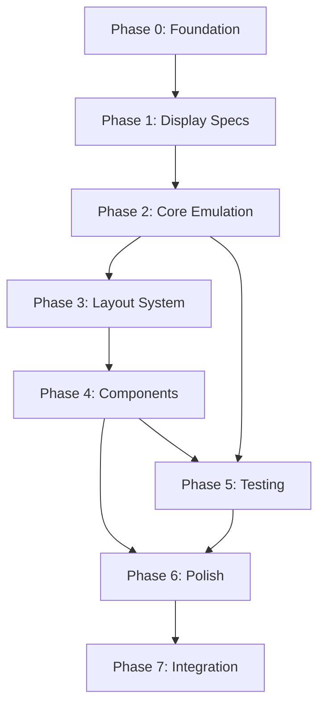

# E-Ink Ecosystem - Development Roadmap

**Goal:** Build a complete, production-ready e-ink UI framework for embedded Rust with desktop emulation and hot reload.

**Approach:** **Emulation-First** - Get realistic e-ink simulation working before building UI framework.

**Timeline:** 6-7 weeks

**Status:** 📋 Planning Phase

---

## Philosophy: Why Emulation First?

Building a UI framework without proper emulation is building blind. We need to:
1. **See what we're building** - Realistic visual feedback from day 1
2. **Test properly** - Can't validate layout/components without realistic display behavior
3. **Iterate faster** - Hot reload with visual emulation beats hardware deploy cycles
4. **Get it right once** - Emulation complexity is independent of UI complexity

**The Right Order:**
```
Emulation Infrastructure (Weeks 1-2)
    ↓
UI Framework (Weeks 3-5)
    ↓
Testing & Polish (Weeks 5-7)
```

---

## Milestones

| Milestone | Target | Status | Dependencies |
|-----------|--------|--------|--------------|
| **M1: Emulation Foundation** | Week 1 | 📋 Planning | None |
| **M2: Realistic Emulation** | Week 2 | ⏳ Pending | M1 |
| **M3: UI Framework** | Week 5 | ⏳ Pending | M2 |
| **M4: Production Ready** | Week 7 | ⏳ Pending | M3 |

---

## Phase 0: Foundation for Emulation (Day 1-2)

**Goal:** Minimal setup to draw pixels on screen.

**Deliverables:**
- ✅ Window creation (winit + softbuffer)
- ✅ Basic framebuffer (Gray4 pixels)
- ✅ embedded-graphics DrawTarget integration
- ✅ Can draw shapes and text

**Tasks:** See [tasks/phase-0-foundation.md](tasks/phase-0-foundation.md) (7 tasks, 8 hours)

**Success Criteria:**
- [ ] Window opens and displays
- [ ] Can draw primitives using embedded-graphics
- [ ] Example program runs

**Outcome:** Foundation for all emulation work

---

## Phase 1: Display Specs (Day 3-4)

**Goal:** Define what displays we're emulating.

**Deliverables:**
- ✅ eink-specs crate
- ✅ DisplaySpec struct with all e-ink characteristics
- ✅ 6+ display templates (Waveshare, GoodDisplay)
- ✅ Refresh timing, grayscale levels, ghosting rates

**Tasks:** See [tasks/phase-1-display-specs.md](tasks/phase-1-display-specs.md) (6 tasks, 12 hours)

**Success Criteria:**
- [ ] DisplaySpec contains all emulation parameters
- [ ] Accurate specs from datasheets
- [ ] Helper methods for timing/temperature

**Outcome:** Know exactly what to emulate

---

## Phase 2: Core Emulation (Week 2)

**Goal:** Realistic e-ink simulation - ghosting, refresh animations, timing.

**Deliverables:**
- ✅ Ghosting simulation & visualization
- ✅ Refresh animations (full: 3 flashes, partial: subtle)
- ✅ Temperature effects on timing
- ✅ DisplayDriver trait implementation
- ✅ Hot reload infrastructure
- ✅ Headless mode for CI

**Tasks:** See [tasks/phase-2-core-emulation.md](tasks/phase-2-core-emulation.md) (18 tasks, 40 hours)

**Success Criteria:**
- [ ] Emulator visually matches real e-ink
- [ ] Accurate refresh timing
- [ ] Ghosting behaves realistically
- [ ] Hot reload works reliably
- [ ] Cross-platform verified

**Outcome:** Production-quality emulation! **Critical checkpoint before UI work.**

---

## Phase 3: Layout System (Week 3)

**Goal:** Build flexbox-like layout engine (eink-system).

**Deliverables:**
- ✅ Flexbox layout algorithm
- ✅ Styling system (EdgeInsets, Style, Theme)
- ✅ Constraint-based sizing
- ✅ Text measurement
- ✅ no_std compatibility

**Tasks:** See [tasks/phase-3-layout-system.md](tasks/phase-3-layout-system.md) (12 tasks, 50 hours)

**Success Criteria:**
- [ ] Layout handles nested containers
- [ ] CSS-like styling API
- [ ] 80%+ test coverage
- [ ] Works with emulator

**Outcome:** Proper layout system tested on realistic emulator

---

## Phase 4: Components (Week 4)

**Goal:** Reusable UI components (eink-components).

**Deliverables:**
- ✅ 12+ components (VStack, HStack, Text, Button, ProgressBar, ListView, etc.)
- ✅ Test ID support on all components
- ✅ no_std compatibility
- ✅ Comprehensive examples

**Tasks:** See [tasks/phase-4-components.md](tasks/phase-4-components.md) (15 tasks, 60 hours)

**Success Criteria:**
- [ ] All components support test IDs
- [ ] Renders correctly in emulator
- [ ] Examples demonstrate all features
- [ ] Works in no_std

**Outcome:** Complete component library

---

## Phase 5: Testing Infrastructure (Week 5)

**Goal:** Comprehensive testing utilities (eink-testing).

**Deliverables:**
- ✅ Test ID query system
- ✅ Screenshot comparison
- ✅ Visual regression framework
- ✅ E-ink behavior assertions
- ✅ Headless CI integration

**Tasks:** See [tasks/phase-5-testing.md](tasks/phase-5-testing.md) (12 tasks, 40 hours)

**Success Criteria:**
- [ ] Playwright-like API
- [ ] Screenshot testing with insta
- [ ] All tests run in CI
- [ ] Complete test suite examples

**Outcome:** Robust testing infrastructure

---

## Phase 6: Polish & Documentation (Week 6)

**Goal:** Production-ready documentation and optimization.

**Deliverables:**
- ✅ Complete API documentation
- ✅ Tutorial series (4+ parts)
- ✅ 5+ example applications
- ✅ Performance optimization
- ✅ Memory profiling

**Tasks:** See [tasks/phase-6-polish.md](tasks/phase-6-polish.md) (15 tasks, 30 hours)

**Success Criteria:**
- [ ] 100% public API documented
- [ ] Tutorials published
- [ ] Performance targets met
- [ ] Memory < 64KB RAM (no_std)

**Outcome:** Ready for public release

---

## Phase 7: SoulAudio Integration (Week 7)

**Goal:** Integrate into SoulAudio DAP project.

**Deliverables:**
- ✅ soul-ui crate with DAP theme
- ✅ All DAP screens (Now Playing, Library, Settings)
- ✅ Simulator integration with hot reload
- ✅ Firmware integration
- ✅ Hardware testing

**Tasks:** See [tasks/phase-7-integration.md](tasks/phase-7-integration.md) (10 tasks, 20 hours)

**Success Criteria:**
- [ ] DAP UI fully functional in simulator
- [ ] Hardware deployment successful
- [ ] Performance < 300ms UI updates
- [ ] Production ready

**Outcome:** Shipping SoulAudio DAP!

---

## Dependencies Between Phases



**Critical Path:** P0 → P1 → P2 → P3 → P4 → P7 (26 days)
**Parallel Work:** P5 can start once P4 begins

---

## Resource Allocation

### Development Time
- Phase 0: 8 hours (2 days)
- Phase 1: 12 hours (2 days)
- Phase 2: 40 hours (5 days) **← Critical!**
- Phase 3: 50 hours (6 days)
- Phase 4: 60 hours (8 days)
- Phase 5: 40 hours (5 days)
- Phase 6: 30 hours (4 days)
- Phase 7: 20 hours (3 days)

**Total: 260 hours (~35 days @ 8h/day)**

---

## Success Metrics

### Technical
- [ ] Emulation visually indistinguishable from real e-ink (Phase 2)
- [ ] All crates compile for `thumbv7em-none-eabihf` (no_std)
- [ ] Test coverage > 80%
- [ ] Hot reload latency < 1 second
- [ ] Memory usage < 64KB RAM

### Documentation
- [ ] Every public API documented
- [ ] 4+ tutorial articles
- [ ] 5+ example applications

### Community (Post-Release)
- [ ] Published to crates.io
- [ ] Blog post announcement
- [ ] GitHub stars > 100 (6 months)

---

## Review Checkpoints

**End of Phase 2 (Week 2):** **CRITICAL CHECKPOINT**
- Emulation must be realistic and reliable
- All future work depends on this
- External validation recommended

**End of Phase 4 (Week 5):**
- UI framework feature complete
- Ready for SoulAudio integration

**End of Phase 6 (Week 6):**
- API freeze
- Documentation complete
- Ready for release

---

## Next Steps

1. ✅ Review and approve roadmap
2. ⏳ Begin Phase 0: Foundation for Emulation
3. ⏳ Set up project tracking

**Last Updated:** 2026-02-14
**Version:** 2.0 (Emulation-First)
**Status:** Awaiting Approval
